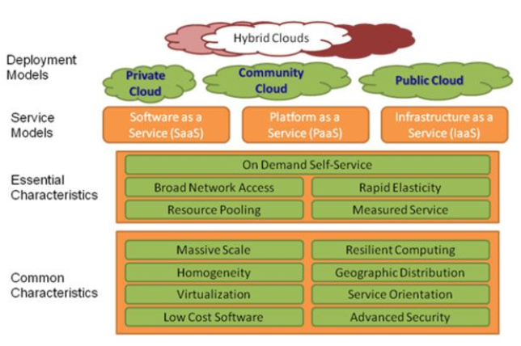
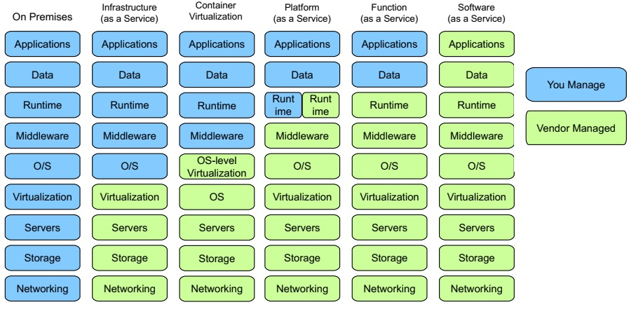
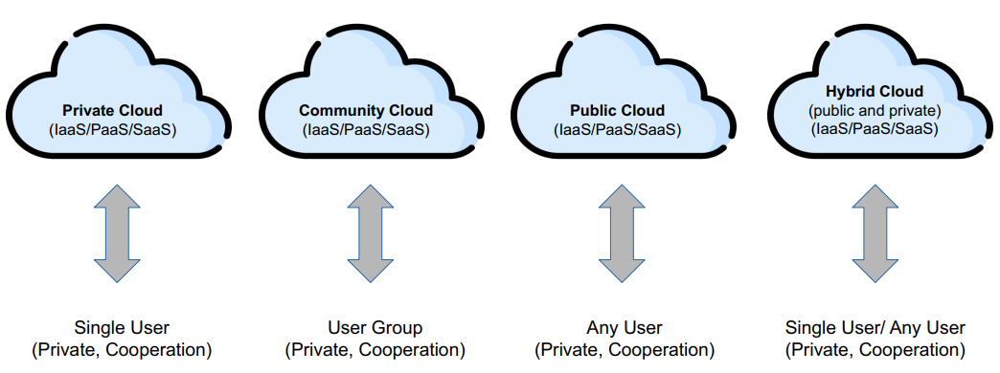

# Introduction and Definitions
Cloud computing is an **economic value proposition**, i.e., the idea is to reduce ICT related costs. This is achieved by sharing resources and allocating them more efficiently.

## Cloud Computing Definition
NIST definition of cloud computing is: 
*“A model for enabling ubiquitous, convenient, on-demand network access to a shared pool of configurable computing resources that can be rapidly provisioned and released with minimal management effort or service provider interaction. This cloud model is composed of five essential characteristics, three service models, and four deployment models.”*

 
*Overview of the NIST definitions of cloud computing*

## Essential Characteristics
The five essential characteristics of cloud computing are:
1. **On-demand, self-service** 
The consumers themselves can provision computing resources through the network, whenever they have the need.
2. **Broad network access** 
The services and capabilities are accessible over the network.
3. **Resource pooling (multi-tenancy)** 
Resources are dynamically allocated to the multiple users (tenants). This is how the CC provider makes money, i.e., sharing the machines over multiple customers (tenants), typically over-subscribing the resources.
4. **Rapid elasticity** 
Resources can be rapidly and automatically provisioned and released as needed. Capabilities grow and diminish according to the demand.
5. **Metered service (pay-as-you-go)** 
Resources usage is monitored and metered, possibly for charching. Keeping in mind that Cloud Computing is a economic value proposition, pay-as-you-go is a more sensible way to deliver this value. Therefore, metered service is very important.

## Service Models
The three service models of cloud computing are:
1. **SaaS** 
The capabilities provided to the consumer are at the application level. The consumer does not manage or control neither the undelying infrastructure (network, servers, data-storage, opearting system) nor application capabilities.
2. **PaaS** 
The capabilities provided to the consumer is to use the providers' infrastructure and supporting services (like data storage, network, servers, etc) to deploy their own applications. The consumer does not manage nor control the infrastructure and network, but has control over the deployed applications and configurations settings for the host environment. Typical users are developers. They can abstract the whole OS and environement and only focus on the app/service development.
3. **IaaS** 
The capability provided to the consumer is to provision processing, storage, networks, and other fundamental computing resources where the
consumer is able to deploy and run arbitrary software, which can include operating systems and applications. The consumer does not manage or control the underlying cloud infrastructure but has control over operating systems, storage, and deployed applications. Typical users are systems engineers (the guys whose job is to set-up environements), So they don't have to care about the network and IT infrastructure.

 
*Management of different components of ICT Stack per Service Model*

## Deployment Models
The four deployment models are:
1. **Private Cloud** 
The cloud infrastructure is provisioned for the use of a single organization, but can be managed by a third-party. The consumers (tenants) are all part of the owning organization. It may exist on- or off-premises.

2. **Community Cloud** 
The cloud infrastructure is provisioned for the use of a specific group of organizations. It can be managed by one or more of these organizations or by a third-party. The consumers are all part of one of the owning organizations. It may exist on- or off-premises.

3. **Public Cloud** 
The cloud infrastructure is provisioned for open use by the general public. It can be made available by a private or public organization (e.g., univertities, governments, etc). It exist on-premises of the provider.

4. **Hybrid Cloud** 
A composition of two or more of the above mentioned deployment models. The different cloud infrastructures must, however, remain unique separated entities.

 
*The four deployment models of cloud computing*

## Fog or Edge Computing
Consists of provisioning multiple smaller-scale data centers at the network's edge (i.e., near the end-users). The claim is that it should reduce latency, allegedly a weakness in cloud computing. The motivation is the increasing deployment of IoT devices and time-sensitive applications. Mr Bohnert believes this argument is questionable, since the latency achievable with traditional cloud computing is already low enough for almost all applications.

## Service Level Agreement (SLA)
Is a contract defining the level of the service a cosumer should expect from a provider. It is a way to establish trust between these two parties. It should define the metrics by which service is measured, as well as remedies or penalties should agreed-on service levels not be achieved. It is a critical component of any technology vendor contract.

