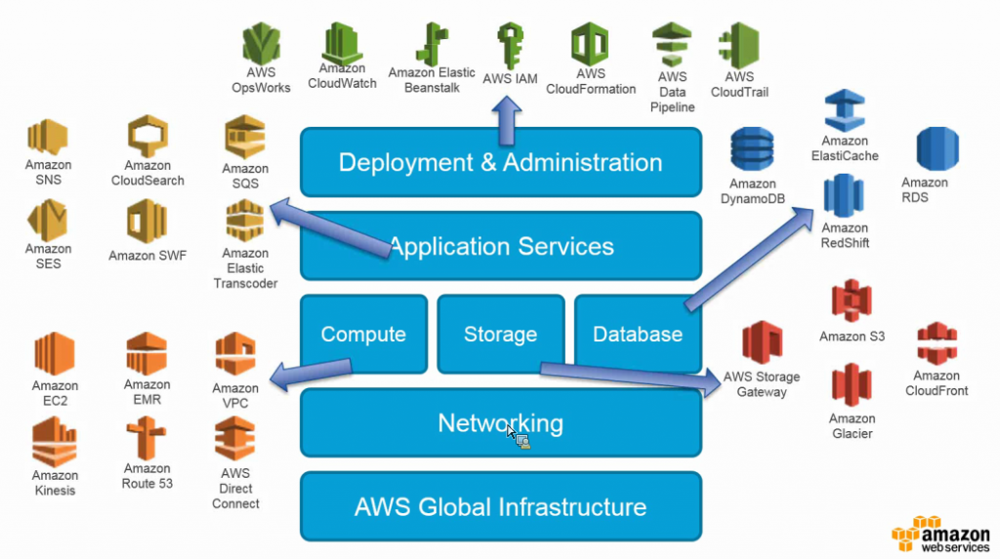
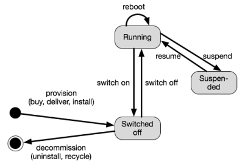
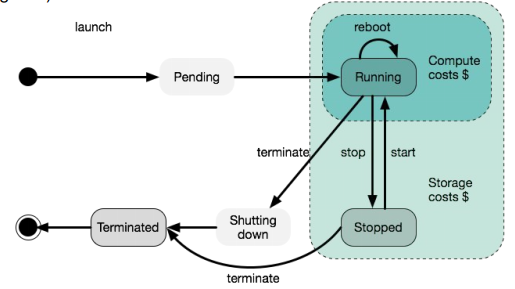
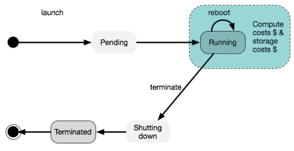
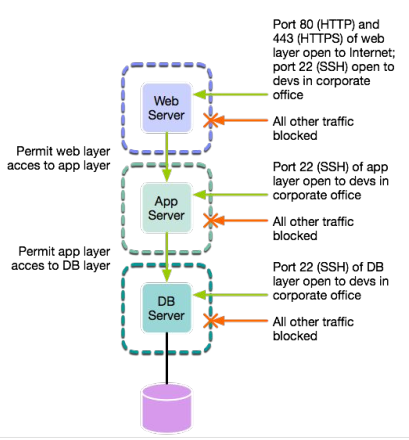

# Amazon Web Services
Global market leader in public cloud computing.
Started as a IaaS provider but nowadays offers a great variaty of services in PaaS and SaaS (and also FaaS).
 
*Gartner's Magic Quadrands for Cloud Computing*

Amazon profits from **economies of scale** in offering cloud computing services. In order to do so, their physical datacenters have minimal human labour; their servers are provisioned in pre-built (physical) containers, which renders provisioning, maintanence and replacements faster and cheaper.

## Numbers
* Huge revenue: $18,5B annual revenue (2021)
* Growing fast: 36% year-to-year (2021)

## Overview of Services
 
*AWS Services overview*

* **Elastic Compute Cloud (EC2)** for computing resources
	* <u>Self-serviceable</u>; virtual machine (VM) instances can be deployed over a web interface.
	* <u>Preset instances</u> with different compute resources and OS images are readily available.
	* <u>Instace models</u> (and their pricing):
		* On-demand instances: Pay-by-the-hour; Start and stop whenever needed.
		* Reserved instances: Pay a yearly upfront and receive discount on hourly usage; Start and stop whenever needed.
		* Spot instaces: Bid for unused EC2 capacity. Set a Spot Price (Bid); if the market rate is less than your bid, the instance is started. Automatically terminates if the market rate rises above the Spot Price.
		
* **Simple Storage Service (S3)** for object storage 
High-performance, highly-available web-oriented storage service that supports very large files. You can write, read and delete objects (files) into S3 containing from 1 byte to 5 TB of data. The number of objects that can be stored is unlimited. Each object is stored in a bucket and a bucket can be stored in one of several regions. Objects stored in a region never leave the region unless you transfer them out.
* **Elatic Block Store (EBS)** for block storage 
An EBS volume is normally used to provide persistent storage to **virtual disk of an EC2 VM instances**. Doing so, provides better robustness since the computing and the storage are in different servers.
* **Amazon Glacier** for backups storage  
Very cheap and fast for writing data, but quite expensice for reading. Therefore, suitable for backups or storage of any kind of data that is rarely accessed.
* **Elastic IP Address** 
An Elastic IP address is a static IPv4 address designed for dynamic cloud computing. An Elastic IP address is allocated to your AWS account, and is yours until you release it. By using an Elastic IP address, you can mask the failure of an instance or software by rapidly remapping the address to another instance in your account. Alternatively, you can specify the Elastic IP address in a DNS record for your domain, so that your domain points to your instance. 
***Obs:** One of the challenges AWS had to solve regarding networking was the translation of public IPs into internal private IPs that can be changed in the internal network as needed.*

## Regions and Availability Zones
26 regions and 84 availability zones. When deploying a cloud recouce, a customer can chose a region and an availability zone within the region. **Regions** are different geographical locations accross the globe. **Availability zones** are separate datacenters inside of a region, each with its own independent infrastructure for power, cooling, etc. This provides geographical robustness.

**Remarks on regions and data privacy:** 
Neither cloud data nor resources will be moved to a different location without the costumer's consent. *In fact, doing so is not even in the provider's economic interest, since moving data and VMs, even inside a datacenter, are costly operations.* 
However, having the server on a specific jurisdiction does not guarantee it to be safe to use for personal data. It might be the case that there is outside access to this data, for example, with support centers in another country.

## Lifecycle of a Physical Server
A physical server can be switched on or off, suspended and resumed. An EC2 instance cannot be suspended, only "switched off" (stopped).

 
*Lifecycle of a Physical Server*

## Lifecycle of an EC2 Instance
If the EC2 VM instance was deployed **with and EBS Volume**, and option called **"Delete on Termination"** can be enabled or disabled (default=disabled). This option determines with the data stored will be kept once the VM is switched off.

 
*Lifecycle of a EC2 VM instance with EBS Volume for storage - If VM terminates, data persists only if "Delete on Termination" option is disabled*

 
*Lifecycle of a EC2 VM instance without EBS Volume - If VM terminates, data will be lost*

## Security
An EC2 instance has an public IP, so it is accessible from the internet. A firewall filter in- and outbound traffic based on port numbers and IP addresses. The rules of a firewall are given by a configuration called **security groups**. The figure bellow illustrates the filtering of the traffic to a three-tier web application based on the security group.

 
*Filtering of the traffic to a three-tier web application based on the security group*

