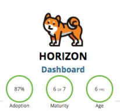

# OpenStack

## Overview
OpenStack is an operating system (OS) that controls large pools of **computing, storage and networking (=IaaS)** resources throughout a datacenter, all managed through a dashboard that gives administrators control while empowering their **users to provision resources through a web interface (on-demand, self service).**

*“The OpenStack Foundation promotes the global development, distribution and adoption of the OpenStack cloud operating system. As the global independent home for OpenStack, the Foundation serves more than 60,000 Individual Members from over 180 countries around the world.”*

A huge OSS project with corporate Sponsorship:
* Platinum:
    * $500k /yr
	* List of 8 members usually set; new company might be admitted only on vaccancy
* Gold:
    * 0.025% of company's revenue; min 50k, max 200k
	* Accepted by approval of the board
* Corporate

 
*Platinum Members*

 
*Gold Members*

 
*Organization*

## Main Services
OpenStack comprise a great number of services; The most important ones are:

1. **NOVA**: For computing 
 
Nova provides VMs on demand. Its key components are:
    * <u>Scheduler:</u> Decides which host gets each VM
    * <u>Network (plugin):</u> (NEUTRON plugin) Manages IP forwarding and VLANs for the VMs
    * <u>Compute:</u> Manages communication with hypervisors and virtual servers
    * <u>Conductor:</u> Handles requests that need coordination; acts like DB proxy; etc.

2. **NEUTRON** For networking 
 
Provisioning VLANs, internal routing, DHCP, etc, for the VMs and servers. Its key components are:
	* <u>Netron-server:</u> Central manager of the network services. Enforces IP addressing of each port
	* <u>Plugin Agent:</u> Plugin of NEUTRON that runs on compute nodes (NOVA). Used to manage the local virtual network configurations.
	* <u>DHCP Agent:</u> Provides DHCP sevices to tenant networks
	* <u>L3 Agent:</u> Provides L3/NAT for external networks
	* <u>SDN Services:</u> Additional services to tenant networks
	
    Typically, 4 distinct networks are deployed in an OpenStack setup:
    1. <u>Management Network:</u> For management access
    2. <u>Guest Network:</u> For regular connectivity within tenants
    3. <u>External Network:</u> For tenants connectivity to the outside
    4. <u>API Network:</u> Used for communication among the different OpenStack services (which communicate through REST)
	
 
*Typical Networks in an OpenStack deployment*

3. **KEYSTONE** For Identity and Access Management 
 
Used by all the other services for authentication. It has pluggable front and backends. It can manage identity (authentication) and access (authorization) using a variaty of tools, like tokens, ACLs, etc.

4. **GLANCE** For image storage 
 
Provides storage and registration of images for VMs. The storage backend is pluggable, enabling the use of a variaty of different solutions (like ceph, swift, cinder, etc)

5. **CINDER** For block storage 
 
Cinder provides block storage for VMs and pluggable backend storage (i.e., for GLANCE)

6. **SWIFT** For object storage 
 

7. **HORIZON** For a dashboard 
 
Offer a modular UI dashboard with info from all the other services. The communication with the other services is through REST. Advanced functionalities are only accessible through CLI.

## Architecture Big Picture
 
*Architecture Big Picture - The bottom layer shows the required infrastrucure for an OpenStack stack*

The communication between all the services happens through REST. In fact, user commands are also REST requests. The CLI is nothing but a wrapper around these API requests, translating CLI commands into REST HTTP requests.

## The (REST) API
APIs generaly support CRUD, i.e., Create, Retrieve, Update and Delete operations. In HTTP methods, they correspond, respectively to POST, GET, PUT, DELETE.

As an example, **NOVA** CLI offers these basic commands: 
<u>server:</u> VM instance in the compute system. 
<u>flavor:</u> Defines an available hardware configuration for the server (disk, RAM, CPU, etc). 
<u>image:</u> a collection of files to create or rebuild the instance. 
<u>reboot:</u> Either soft or hard reboot of a server. 
<u>rebuild:</u> Replace the server with a specified image. 
<u>resize:</u> Change the flavor; used to scale the server up or down. 

An use example could be: 
 

Which effectively tranlates to a REST API request with the format close to this: 
 

## HEAT Orchestration Template (HOT)
 
A more advanced OpenStack service is **HEAT**, that can be used for the orchestration of many services. This orchestration is accomplished by means of a template file. This file is called a **Heat Orchestration Template (HOT)** and is defined in YAML format. It allows the creation of most OpenStack resources (such as instances, floating IPs, volumes, security groups and users). The most important <u>sections</u> in a HOT are:

1. **resources:** (Mandatory) Contain the declaration of the single resources to be deployed in the stack, like NOVA VMs, CINDER volume, NEUTRON network definitions, etc. At least one resource must be declared in any HOT.
2. **parameters:** (Optional) Specify the input parameters (variables) to be provided to the template upon instantiation. 
3. **output:** (Optional) Defines output parameters (variables) available to users once the template has been instantiacted.
4. **conditions:** (Optional) Statements that can be used to restrict the creation of a resource or the definition of a property. 
5. **others:** *parameter-groups* define how the input parameters should be (logically) grouped. *heat_template_version* declares the YAML is a HOT. *description* is a human readable description.

The creation of resources could have dependencies:
 

The *depends_on* primitive is useful to control the order of creation of resources in a HOT since different resources take different times to be created.

**HOT Intrinsic Functions:** 
Functions to retrieve values for outputs, conditions and provide some useful features:
 
*HOT built-in functions*

**Putting all together:** 
HOT Example:

 

In this example, a port is assigned in the server creation, which comes before the ports creation. In general we should create the server at the end.

