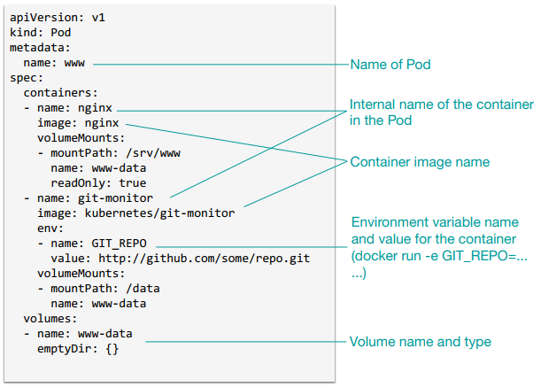
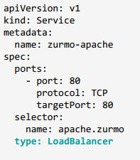
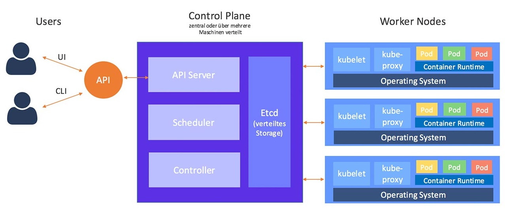
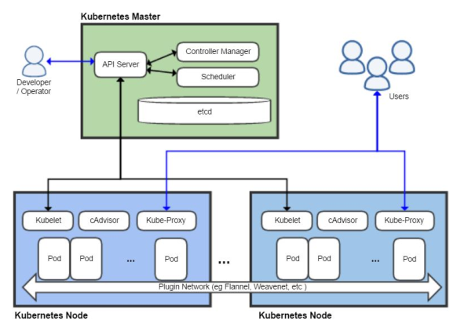
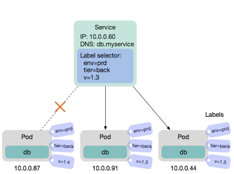
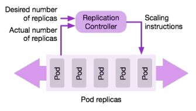
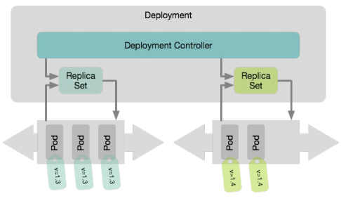
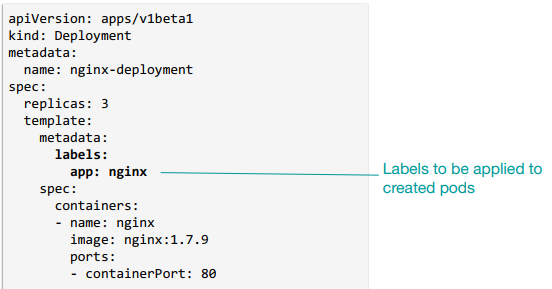
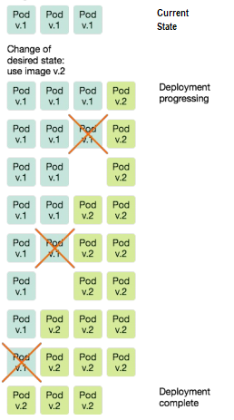

# Kubernetes

Kubernetes is a **container orchestrator** along a computer cluster. It manages which container is to be deployed in which node and offers many features to automatically scale conteinerized (distributed) applications, like micro-services. Kubernetes can be seen as a container cluster manager.

## Concepts
### Cluster
Set of machines where pods are deployed, managed and scaled.

### Node
A single machine in the cluster, <u>virtual or physical</u>. nodes are connected via a "flat" network.

### Pod
Consist of one or more containers (typically one) and is the basic unit of scheduling in Kubernetes. If there are multiple containers in a pod, they always run in the same node (pod is deployed in a single node). All containers in a pod share the same environment (IP address, namespace, storage volumes, etc). The pod abstraction enables the user to choose between **loosely coupled** or **tightly coupled** containers, i.e., depending on the degree of dependence of two containers they should be deployed in the same or different pods. 
**lifecycle:** If a pod fails, for whatever reason, Kubernetes does not try bring it back alive, but rather starts another one in its place with new pod id, IP address, etc (*cattle, not pets*). Pods are defined via API: 
     
	*Example of Pod Definition*
	
### (Pod) Volume
Provide storage for the containers inside a same pod. Lifetime is the same as the pod, unless **persistent volume** solutions from the undelying infrastructure have been used. A particular type of volume is **secret**, which is used for sensitive information, like passwords. Secret volumes are backed by tmpfs (a RAM-backed filesystem, non-persistent) so they are never written to non-volatile storage.

### Service
A logical set of pods that work together. It also serves to expose one or more pods (that work together) to the network and provide load balancing. it offers a stable endpoint for pods (which receive different IPs everytime they are redeployed). 
 
*Example of Service Definition*

The service types are:
* **ClusterIp:** Use a cluster internal IP to provide a stable endpoint to a group of pods.
* **NodePort:** Used to expose the service on a port on each node of the cluster
* **LoadBalancer:** Balancing of requests among each node

### Kubernetes object (and its API)
An object can be a pod, volume, service, deployment, replicaset, etc. Kubernetes adopts a consistent API for defining any object. It is JSON based, which can also be written as YAML (most commonly, like the examples above). The API has three basic <u>fields</u>:
* **metadata:** Information about the object, like name, ID, version, etc.
* **specs:** Used to describe the desired state of the object.
* **status:** Provides read-only information about the actual state of the object.

### Label (and selector)
A user can assign key-value pairs (called labels) to any API object metadata in the system. **Selectors** can then be used to query objects based on labels. This is a powerful mechanism for grouping pods into services.

## Kubernetes Architecture
 
*Kubernetes Architecture*

The Kubernetes architecture comprises the Master (or Control Plane) Node and the Worker Nodes.

### Master Node (or Control Plane Node)
This node controls the activities in the cluster. To protect the Kubernetes cluster from failures
of the Master Node the Master Node can be replicated. Its components are:
* **API Server:** Serves as the communication gateway for the master node (and thus, for the cluster). It allows users and processes to communicate with the master. Definitions are given using the JSON/HTTP based API (mostly in YAML format).
* **etcd:** Key/value backend storage used for keeping track of the configuration and state of the cluster. It is accessible from the worker nodes so they know what to do. It also contains the schedules set by the *scheduler* and the configuration set by the *Controller Manager*.
* **Scheduler:** Selects which node an unscheduled pod should run on based on resource availability.
* **Controller Manager:** Process in which core controllers run, such as Replication Controller, Deployment Controller, and DaemonSet Controller. It monitors the deployments, write replicas into the replicaSets and write pods templates.

### Worker Nodes
These are the machines where the pods are actually deployed. Each machine has its **Container Runtime**. Formerly, **Docker** was the default container runtime of Kubernetes. Now it is being deprecated in favor of a Open Source standard called **Container Runtime Interface**, or **CRI**. Any container runtime that implements CRI will work with Kubernetes (e.g., Potman from Redhat). The components in a worker node are:
* **Kubelet:** Manages the running state of each node. It monitors the etcd to check if there is any pod scheduled to by deployed in its node. It also report failures to the master node. It starts the pods with the available Container Runtime.
* **Kube-proxy:** A network proxy and load balancer. Responsible for routing traffic to the appropriate container based on the IP and port number of the incoming request.
* **cAdvisor:** Agent that monitors and gathers resource usage and performance metrics of the containers.
* **Overlay Network:** Responsible to connect containers on different nodes on a flat network.

 
*A different view of Kubernetes Architecture*

## Functionalities

### Connecting Pods to Services via Labels
Labels can be used to specify which pods belong to a service. Every object can have multiple labels. When defining the service, a **Label Selector** can be defined, which is a set of conditions on the label key-values. Pods matching the conditions are connected to the service.

 
*Connecting Pods to Services using labels**

Kubernetes must then keep a mapping between labels and current IP addresses of the host running a given pod. This works by means of name resolution.

### Replication Controller
A loop that drives the **actual cluster state** to the **desired cluster state**. It takes a pod definition and deploys a desired number of replicas of it. A background loop checks the number of replicas. 
 
*Replication Controller*

However Replication Controllers are slowly being replaced by **Deployments**

### Deployments
In addition to the resilience offered by **Replication Controller**, Deployments add features that enable software release management without service interruption, like **Rolling Updates** and **Rollbacks**. To do so, Deployments make use of **Replica Sets** which are control loops similar to Replication Controllers.

 
*Deployment* 

Deployments also follow the principle of *desired vs actual state configuration*. The desired state must be defined in a **Deployment Object** via the API. The Deployment Controller compares the desired state to the actual state and changes the actual state towards the desired state.

 
*Example of Deployment Definiton* 

**Example of a Rolling Update** 
To trigger a rolling update, the user simply changes the desired state of the deployment. In a rolling update, the service is never interrupted.

Example 
*Current State*: Three pods using image v.1 
*Desired State*: Three pods using image v.2 
*Deployment creates a new ReplicaSet* 
*Deployment Controller creates a new pod in the new replica set. If successful, terminates a pod in the old replica set.*

 
*Rolling Update*