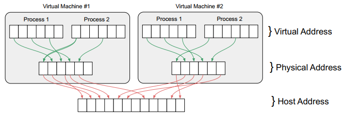

# Compute Resource Virtualization
Virtualization allows better use of physical computing resources (CPU, RAM, etc) since they can be shared among several VMs while keeping **isolation** between the individual environments. Key advantages are **more efficient use or resources** and **consolidation to reduce hardware costs**.

## Simulation, Emulation and Virtualization
**Simulation** 
Model the actual system, however, there is no direct link to actual system nor any implementation of its specifcation.

In other words, the idea is replicate the output of a given system with no concern about the system internal components.

**Emulation** 
Not only the output, but the implementation that approximates the behavior of the actual system but is not necessarily based on the implementation of the actual system.

Differently from simulation, here the internal components of the system and the way they work also need to be taken into account (possibly individually simulated).

*"In a simple and summarized way, emulation is the act of executing code targeted to an external system, with a different architecture, through assembly conversion to a language that the host CPU can understand."* [SOURCE](https://gil0mendes.io/blog/lc-3-part-1/)

**Virtualization** 
Implementation that approximates the behavior of the actual system by using parts of or the entire implementation of the actual system.

In other words, it is a kind of emulation where parts of the target system and its internal components are actually used.

## Type I and II of vitualization
**Type I, or Baremetal vitualization** 
The **hypervisor** sits between the host hardware and the guest OS. 
 
*Type I Virtualization* 
Pros:
* Better performance; better suited for servers
* No host OS to mantain

Cons:
* Hardware support is limited, since the hypervisors have limited builtin drivers
* Not suitable for workstations

**Type II** 
The **hypervisor** runs on top of a hostT OS. Here, the host OS must emulate hardware resources. 
 
*Type II Virtualization* 
Pros:
* Better hardware compatibility, since the hypervisor does not need the hardware drivers (the host OS takes care of that)
*  Flexible deployments, on-demand start/stop, parallel to Host-OS, parallel VMMs

Cons:
* Host OS is a potential performance bottleneck
* Host OS must be mantained and is the interface to the physical resources

## Full Virtualization (of x86 architecture)
**Full Virtualization** is a complete abstraction of the physical hardware. Therefore, <u>the guest OS does not need to be modified and has no idea it is being virtualized</u>. As a consequence, the hardware abstraction is largely dependend on the computer architecture.

### Virtualizing Privileged Instructions
Very complicated! 
The **problem** here is that, since the guest OS does not know it is beign virtualized, the **it believes it has privileged access to the CPU instructions**, as it is normaly the case for an OS. But only the hypervisor/host OS have access to this kind of instructions (like REBOOT).

One approach is called **Binary Translation**. Here the hypervisor constantly monitors the codes from the guest OS, intercepts privileged instructions and replaces them with new sequences that have the intended effect only on the VM of the guest OS. This is a very heavy approach.

A second approach is the use of **Hardware Extensions**. Provided the hardware has this extensions, no binary translation is needed. Here, a new mode for the excecution of instructions is added (in addition to **user** and **root modes**). It is called **non-root** mode. The guest OS runs in this mode and when it issues a privileged instruction, it is traped by the CPU, which in turn hands the instruction to the hypervisor to solve the issue (in root mode). Once the hypervisor has taken care of the instruction, it hands back control to the guest OS. This is much faster and simpler than binary translation.

### Virtualizing Memory
Even without virtualization, computer architectures offer **virtual memory** to the OS. Virtual memory bundles many physical memory addresses **(PA)** into a single virtual memory page **(VA)** which always begins in the x00 address, giving the OS the illusion of exclusive ownership of the address space.

This is done through a **Page Table**, which maps entries between VAs and PAs. Once access is required the Memory Management Unit **(MMU)** searches the table for the right PA. Caching can improve speed here.

The **problem** is, how to share PA among all VMs? One approach is the use of a **Shadow Page Table**, which makes two translations: 
VA <-> PA (PA is emulated by the hypervisor) 
PA <-> HA (actual Host Address) 

Once a Guest OS requests access to VA, request is intercepted and MMU is instructed to look into the respective Shadow Page Table of the VM that’s running the Guest OS.

 
*Shadow Page Memory Translation*

Another approach is through **hardware extensions** to perform this double address translation without shadow tables, making it faster.

## Paravirtualization
As we've seen, virtualizing privileged instructions is very complicated. One way to avoid it is to use Paravirtualization instead of Full Virtualization. <u>**Paravirtualization** is a technique in which the hypervisor provides an API to allow the guest to talk directly to the underlying hardware</u>. These are called **hypercalls**. Paravirtualization requires modifications to the guest OS and makes it aware of the virtualization.

 
*Paravirtualization*

Full Virtualization with hardware extensions (HVM) is better for virtualizing CPU, but paravirtualization performs better with storage, devices and networks.

## QEMU and KVM
### Quick Emulator (QEMU)
A generic and open source machine emulator and virtualizer. Competes with Virtualbox, VMware (type II), etc.

QEMU modes: 
* <u>Full-system emulation</u>: Run operating systems for any machine, on any supported architecture
* <u>User-mode emulation</u>: Run programs for another Linux/BSD target, on any supported architecture
* <u>Virtualization</u>: Run KVM and Xen virtual machines with near native performance

### Kernel-based Virtual Machine (KVM)
<u>Of feature of Linux kernel to allow it to function as a type I hypervisor</u>. It is a cheaper alternative to commercial products. It is OpenStack default hypervisor.

A clever (and cheap) implementation of virtualization consists of running Linux on the host machine and using KVM as the hypervisor. All the VMs could then be QEMU instances, providing flexibility on the virtual environment.

 
*Virtualization with KVM + QEMU*

In this setup, QEMU provides the virtualization/emulation while KVM provides QEMU shared access to the host resources.
