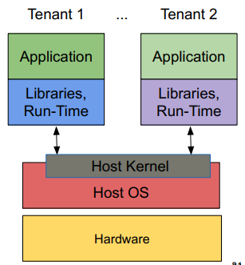
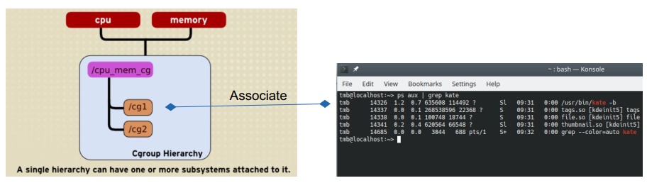
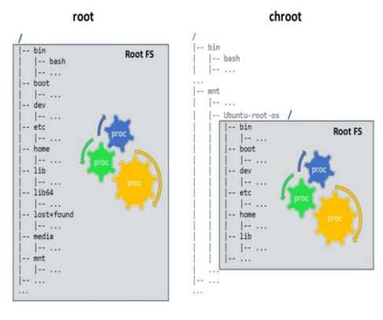
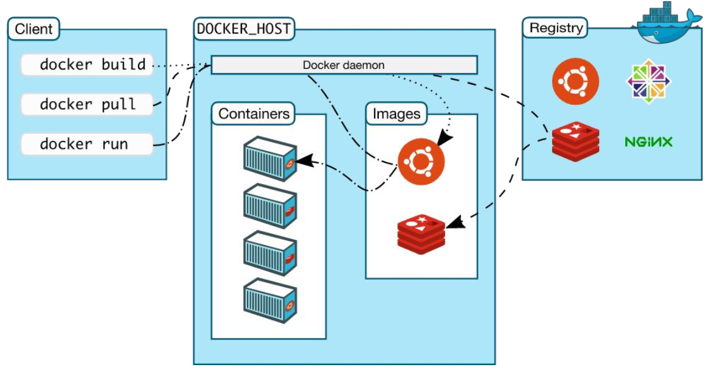
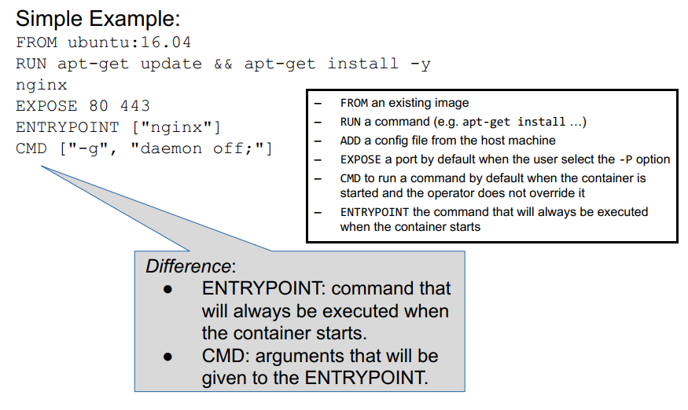

# OS-Level Virtualization
Virtualization allows better use of physical computing resources (CPU, RAM, etc) since they can be shared among several VMs while keeping **isolation** between the individual environments. Key advantages are **more efficient use or resources** and **consolidation to reduce hardware costs**.

With **OS-Level Virtualization** the OS itself provides <u>isolation</u> of resources among all the tenants. 

 
*OS-Level Virtualization*

In order to provide isolation, the OS needs:
1. To control **visibility** of the shared resources among the processes (tenants)
2. Same for **access**
3. Same for **use** (think, how much resources is a particular proccess allowed to use)

## CGroups
Linux is able control **access and use** by means of **Control Group (Cgroups)**. Cgroups <u>control to which resources and how much of it each a process can access</u> (resources like, CPU time, system memory, network bandwidth, etc). Cgroups also provide monitoring of resources usage. 

Some definitions:
* A **cgroup is a collection of processes** that are **bound to a set of limits** or parameters defined via the **cgroup filesystem.**
* A **subsystem**, aka **controller** is a kernel component that modifies the behavior of the processes in a cgroup.

The cgroups need to call the **controllers**, which effectively provide the resources to the processes in the cgroup.

Muck like processes, cgroups are organized hierarchicaly, with children cgroups inheriting certain attributes from parent cgroups. However, there are <u>mutiple hierarchy trees since each resourse is controlled by a different controller/subsystem. Therefore, for each controller, there is a hierarchy tree.</u>

In Linux, everything is a file. **Also cgroups have their definition given by a file in Linux filesystem**. The cgroups file system is a virtual FS (does no exist in any physical media). By interacting with this filesystem, an user can:
* Create hierarchical directory/file structures
* Ask kernel to add (mount) resource control interfaces for all sorts of resources into directory structures in form of files
* Define rules by editing files provided by resource control interface
* Associate processes (PID) with control configuration
* Kernel executes processes within configuration

<u>For example,</u> */sys/fs/cgroup/devices/group0* is a directory for control groups for the subsystem of devices. In this (user created) directory, a file like *devices.deny* can be created with rules to deny access of processes to specific devices.

*Process association by mean of files in the hierarchical cgroups filesystem*

## Namespaces
Linux is able to control **visibility** of process (i.e., what a process is allowed to see) by means of **namespaces**.
* <u>Isolation</u>: A namespace wraps a global system resource in an abstraction that makes it appear to the processes within the namespace that they have their own isolated instance of the global resource.
* <u>Visibility</u>: Changes to the global resource are visible to other processes that are members of the namespace, but are invisible to other processes.

The use of namespaces is:
1. Construct namespace
2. Create process(es) in namespace (typically done when creating namespace)
3. If necessary, initialize “connectivity” to parent namespace

## Linux Containers
By using namespaces and cgroups in conjunction, one can isolate processess (restrict visibility) and define the resources they have access to. This is the basic idea of a **container**, which is a Linux old concept. The container can be seen as a set of rules that determine what an application (process) can do, basically associating its PID to a namespace and by defining the cgroup rules for the PID (*OS-Level virtualization is the foundation of containerization*).

## Chroot
The change root command, **chroot**, is another tool for managing the visibility. Chroot, **aka pivot_root**, changes the root directory of a calling process. The root directory is then inherited by all children of the calling process. There is no way for a process to know that it is not the system root. That adds security (if someone hacks into the system and gain root access, it will be valid only inside the pivot root). 
 
*Pivot Root*

## Docker
Docker created a framework to enable developers to manage the creation of OS-Level Virtualization (creating containers in Linux). Developers don't work on Linux terminals, so Docker creates value by enabling them to easily add **isolation and portability** to their applications.

A KEY FEATURE OF DOCKER IS **DEPENDENCY RESOLUTION**. Others are:
* <u>Portability</u>: Portable deployment of applications (application plus environment) across machines
* <u>Application-centric</u>: User facing function geared towards application deployment, DevOps
* <u>Build automation</u>: Create containers from build files
* <u>Versioning support</u>: Software development best-practices
* <u>Component reuse</u>: Any container can be used as a base, specialized and saved
* <u>Sharing</u>: Support for public/private repositories of containers
* <u>Tools</u>: CLI / REST API for interacting with docker

 
*Docker Tool Chain*

Keeping in mind that a Docker container is comododitization of Linux containers, in the sense that it wraps features and functionalities around them, one can say that **a Docker container is a runnable instance of an image that is defined by the image iself as well as any configuration options**.

* An image is a collection of read-only content for creating a Docker container
* Docker containers are based on own images or those created by others and published in a Registry
* To build an image, a Dockerfile is created with a simple syntax for defining the steps needed to create the image and run it
* Each instruction in a Dockerfile creates a layer in the image
* When you change the Dockerfile and rebuild the image, only those layers which have changed are rebuilt.
* Docker images are therefore lightweight, small, and fast, when compared to other virtualization technologies.

 
*Docker File*

