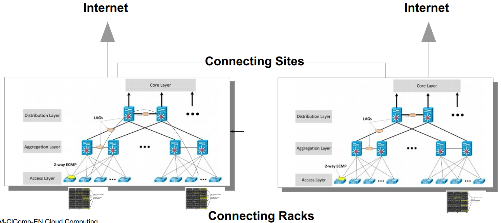
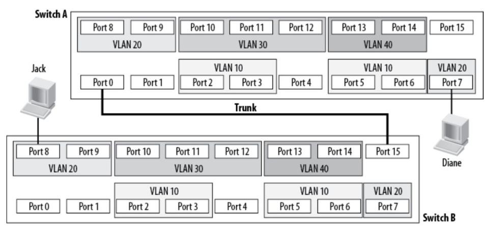
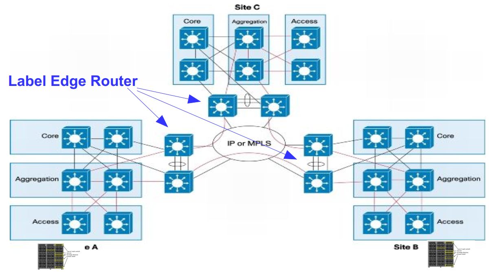
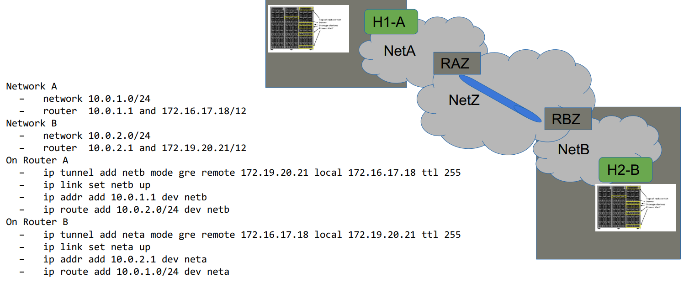
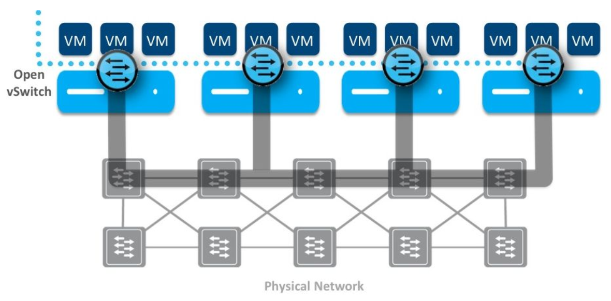

# Network

## Data Centers
Can be owned or rented from a co-location. A modern DC (specialy those suitable for cloud computing) must meet these requirements:
* Be able to support different stakeholders (providers, customers)
    - Internal and external view, providers, customer, administrator
* Be robust and redundant
    - Expect that a system, where components will fail
* Be modular and support heterogeneity
    - Switches/Hardware from different vendors, with different link speed, with different protocols, with different etc.
* Be simple in the scaling characteristic
    - It should be easy to scale up as well to scale down, no complex and mostly automated configurations
* Be flexible in the topology
    - Topology must be flexible to support all sorts of connectivity services, Rack-To-Rack, Rack-to-Internet, Rack-to-Enterprise, Site-to-Site, and many more
* Be efficient and effective
    - Traffic engineering within a site or between sites
* Be able to isolate tenants
    - A DC should be able to host and isolate different tenants (organizations/companies/users/etc)

### Layered Architecture
The typical architecture of a data center networks is a layered design consiting of:
* **Access Layer**: Switches to which the racks with the servers are connected to. They provide no direct interconnect, i.e., no inter-rack connection. Only L2 connectivity. Security measures are critical in this layer.
* **Aggregation Layer**: Aggregates the uplink of all access layer switches. Any inter-rack communication can be done here. L2 and L3 connectivity. Needs more capacity than access layer. Switches are oversubscribed
* **Core Layer**: Aggregates the uplink of all aggregation layer switches. Speed is the keyword in this layer. This layer provides external connectivity.

 
*Layered Design*

This layered approach makes it easier to provide **high-availability**, **scalability**, **redundancy** and **load-balancing**.

Rack-to-rack connection is inneficient, but can be arranged by the DC provider upon request (CROSS CONNECT WIRING).

Site-to-sito connectivity can happen at L2 with MPLS (often considered L2.5)

### External Connectivity
Internet connectivity must be redundant and provider-agnostic. A DC provider must have internet connectivity from multiple providers with redundant links.

## L2-Virtualization
### VLANs
A way of dividing a single physical broadcast domain into multiple logical broadcast domains. Defined by 12-bits, resulting in 4096 possible VLANs.

**Port-Based** 
Each switch has a mapping of port-to-vlan. When a packet needs to be sent through a trunk port (connection between two L2 devices, like switch-to-switch), the sending switch needs to add the vlan information to the frame. This is the simplest and fastest VLAN mode, since there is no need for packet overhead or inspection.

 
*Port-based VLANs*

**Tag-based** 
Each ethernet packet has a VLAN tag that can be added by the sending device (e.g., a workstation) or the receiving switch. In this flavour, the added bits to the ethernet frame also support QoS. In trunk ports, packets are sent with no changes. In comparison to port-based, this VLAN mode introduce some latency since the packets must be inspected.

### WAN - MPLS
A fast protocol for fowarding packets through a network. Usually used for fast site-to-site forwarding. It is based on labels, so no IP lookup is needed. A MPLS network consists of the following device-roles:
* **Label Switch Router (LSR)**: Switch capable of forwarding packets based on their labels. Also performs label operations, like push, pop and swap.
* **Label Edge Router (LER)**: Sits at the edge of the MPLS network and pushes labels to the ingress traffic as all as pops labels from egress traffic.

MPLS supports QoS. If a packet enters a MPLS network, it will be labeled by the Label Edge Router (LER, Edge Device, ingress point)

 
*MPLS Network*

## L3-Tuneling (Generic Routing Encapsulation)
Generic Routing Encapsulation **(GRE)** offers a way to encapsulate protocols inside other protocols. It is ofter used to send IP-over-IP by tunneling packets through predefined gateways essentialy creating point-to-point network connections.

 
*GRE Tunneling*

## Virtual Networking
In order to apply all the infrastructure and features described above to cloud computing, the following must be met:

* The physical network end-to-end (DC-internal and potentially external) becomes a shared resources
    * Need for multi-tenancy support
* Different tenants do share the same links
    * Need for isolation
* Tenants require a flexible network
    * Self-Service interface
    * On-demand instantiation and release
    * Scale according to demand
    * Quality of Service support
    * Pay-as-you-go

Virtualizing the network is a way to provide network resouces for the VMs/containers in a server while keeping isolation and offering multi-tenancy. **Open vSwich** is a Open Source solution for creating and managing virtual networks.

 
*Concept of Virtual Networking*

<u>With virtual networks, a single physical network can be divided into multiple logical networks or multiple physical networks can also be merges into one single logical network.</u>