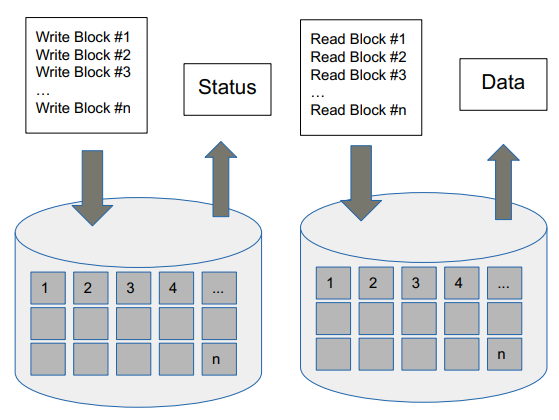
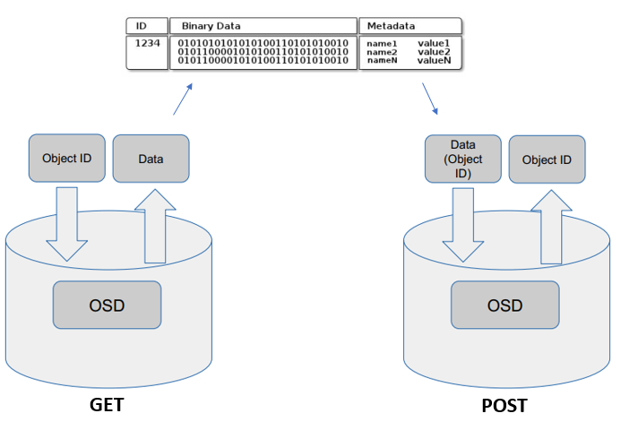
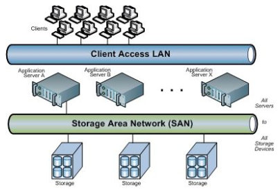
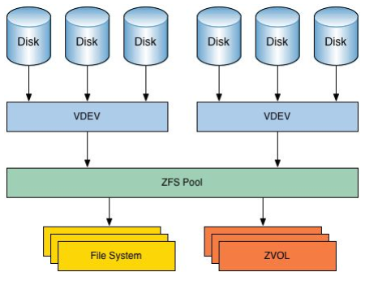
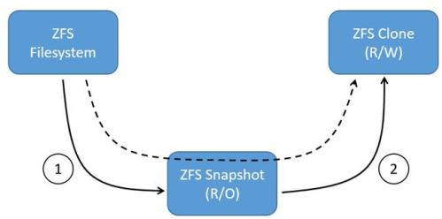
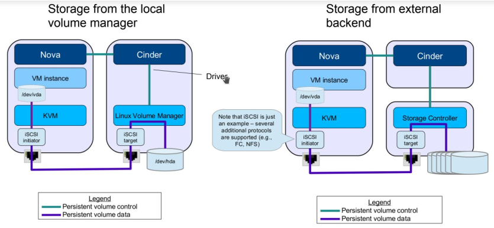
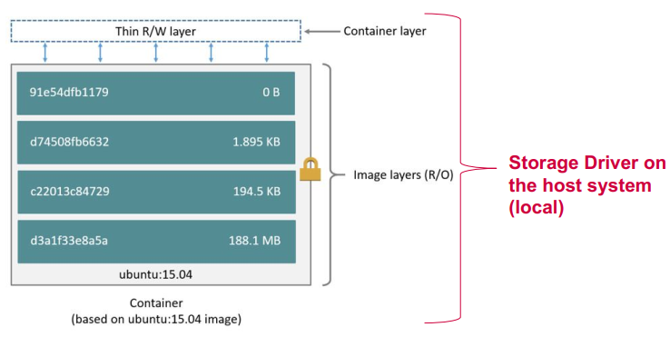
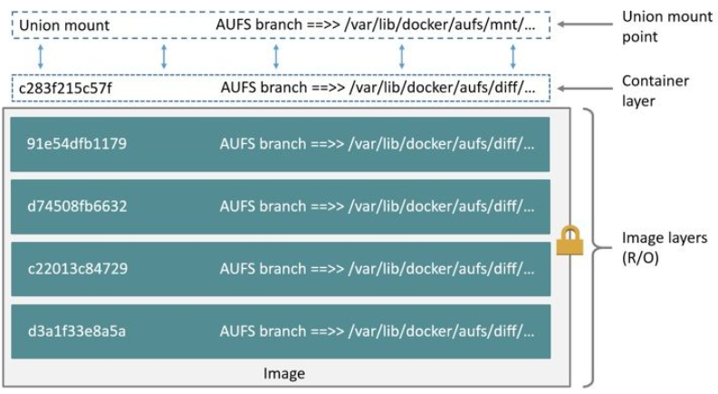

# Cloud Storage
Cloud storage provides logical storage pools that are available over the network (broad network access principle) and that abstracts a larger and more complex (almost certainly distributed) physical infrastructure made of commodity hardware. **The idea is to separete storage service from storage deployment**.

## Block storage
*Block storage is the oldest and simplest form of data storage. Block storage stores data in fixed-sized chunks called blocks. Because the data is piecemeal, the address is the only identifying part of a block — there is no metadata associated with blocks.* [Source](https://cloudian.com/blog/object-storage-vs-block-storage/)

 
*Block Storage*

## File storage
The concept of a file is an abstraction over block storage, generally introduced by the OS (with a File System). Hierarchical organization of directories. Data is stored as single files, each consisting of the data itself plus some metadata.

## Object storage
Object is a data blob. It can (but must not) be a single file. Key components of the object are:
* The data itself
* The metadata, containing key-value pairs that allow for quering, retrieving and organizing data
* Unique ID, which identifies the object.

**Object storage** is great for unstructured data. The is no hierarchical structure; objects are stores into containers called buckets and there is no such thing as a nested bucket. **Data is accessible over REST.**

 
*Object Storage*

**CRUD** operations are possible, <u>however, there is no UPDATE *per se*</u>. Updating is achieved by a DELETE + CREATE.

*Compared to block storage, object storage is much newer. With object storage, data is bundled with **customizable metadata tags** and a **unique identifier** to form objects. Objects are <u>stored in a flat address</u>space and there is no limit to the number of objects stored, making it much easier to scale out.* [Source](https://cloudian.com/blog/object-storage-vs-block-storage/)

## Storage Area Network (SAN)
Dedicated network to access consolidated **block storage devices**. An array of multiple devices is made available over the network. ** Does not provide any file abstraction, only block level operations** (mountable).

 
*SAN*

**A popular protocol for accessing block devices over the network (over IP) is iSCSI**. There is a target (server) and an initiator (client).

 
*iSCSI*

## Network Attached Storage (NAS)
*NAS is a single storage device that serves files over Ethernet and is relatively inexpensive and easy to set up, while a SAN is a tightly coupled network of multiple devices that is more expensive and complex to set up and manage. From a user perspective, the biggest difference between NAS and SAN is that NAS devices deliver shared storage as network mounted volumes and use protocols like NFS and SMB/CIFS, while SAN-connected disks appear to the user as local drives.* [Source](https://www.backblaze.com/blog/whats-the-diff-nas-vs-san/#:~:text=NAS%20is%20a%20single%20storage,to%20set%20up%20and%20manage.)

## CAP Theorem
Applies to all **distributed systems**, but is specially relevant for storage. 
Conjecture: it is impossible for a distributed computer system to simultaneously provide all three of the following guarantees:

* **Consistency**: Data is always the same at all nodes
* **Availability**: Always reply to client requests
* **Partition Tolerance**: The system remains operational even in case of failure of single components (e.g., network link)

In case of a network failure (system is partioned - split brain) object replicas may be divergent and a client tries to access a partition: 
    If still reacheable, the data might be inconsistent 
	If consistency is preserved, the system might be unavailable 
	
<u>AC</u>: Is only possible if system runs on a single machine **(non-distributed)** 
<u>PA</u>: Available and partition-tolerant systems, may provide outdated data but clients “always” receive a reply **(e.g., DNS system)** 
<u>AC</u>: Consistent and partition-tolerant systems, may stop replying to client
requests, but provided data is always consistent **(e.g., flight booking system)**

## CINDER
Is OpenStack service to provide block storage to end users via NOVA. Supports both local and remote storage volumes. CINDER volumes lifecycle independent from compute instances.
A **scheduler** gets to decide which host a particular volume will be attached to.

**Local Disk** is much simpler to deploy and has higher performance, but requires the host machine (of the VM) to have physical storage and is less resilient.

### Storage systems
Cinder and Nova support multiple remote storage backends.
### CEPH
*Ceph is an open-source software-defined storage platform that implements object storage on a single distributed computer cluster and provides 3-in-1 interfaces for object-, block- and file-level storage. Ceph aims primarily for completely distributed operation without a single point of failure, scalability to the exabyte level, and to be freely available.* [Source](https://en.wikipedia.org/wiki/Ceph_(software))

### NFS
Backend distributed file system. Simple, but can introduce bottlenecks.

### ZFS
Very powerful local file system with advanced features (data protection, CoW, thin provisioning, compression, deduplication, etc) and Software-defined approach to manipulate storage resources. It organizes **physical disks into vdevs** and **vdevs into pools**. **Pools are then used to allocate file systems, volumes, snapshots and clones.**

 
*ZFS*

* <u>filesystems</u>: file-level access, thinly provisioned, with space allocated from the zpool on demand
* <u>snapshots</u>: read-only space-efficient point-in-time copies of filesystems
* <u>clones</u>: Read-write copies of snapshots. Used for storing the differences from the previous layer

 
*Filesystems, Snapshots and Clones*

CINDER also support iSCSI for block level access to the distributed storage devices.

 
*Cinder for Providing Storage to VMs*

## Storage in Docker Containers
*Each container is an image with a readable/writeable layer on top of a bunch of read-only layers. These layers (also called intermediate images) are generated when the commands in the Dockerfile are executed during the Docker image build.* [Source](https://jessicagreben.medium.com/digging-into-docker-layers-c22f948ed612#:~:text=What%20are%20the%20layers%3F,during%20the%20Docker%20image%20build.)

 
*Docker Layers*

### AUFS
*AUFS is a unification filesystem. This means that it takes multiple directories on a single Linux host, stacks them on top of each other, and provides a single unified view. To achieve this, AUFS uses a <u>union mount</u>. AUFS stacks multiple directories and exposes them as a unified view through a single mount point. All of the directories in the stack, as well as the union mount point, must all exist on the same Linux host. AUFS refers to each directory that it stacks as a branch. Within Docker, AUFS union mounts enable image layering. The AUFS storage driver implements Docker image layers using this union mount system. AUFS branches correspond to Docker image layers.*[Source](https://gdevillele.github.io/engine/userguide/storagedriver/aufs-driver/)

 
*Under the hood; Docker layers mounted with AUFS*

### Copy-on-Write
*Copy-on-write is a strategy of sharing and copying files for maximum efficiency. If a file or directory exists in a lower layer within the image, and another layer (including the writable layer) needs read access to it, it just uses the existing file. The first time another layer needs to modify the file (when building the image or running the container), the file is copied into that layer and modified. This minimizes I/O and the size of each of the subsequent layers. These advantages are explained in more depth below.*[Source](https://docs.docker.com/storage/storagedriver/#:~:text=checkpoint%2Frestore%20feature.-,The%20copy%2Don%2Dwrite%20(CoW)%20strategy,just%20uses%20the%20existing%20file.)

**File/Dir modifications**
* If element is modified in union and is in topmost layer, it is simply modified in this
layer
* If element is modified in union and not in topmost layer, element is copied-up **(copy-up)** to topmost layer and modifications applied there.

**File/Dir removal**
* If element is in topmost layer, it is removed from the topmost layer only
* If element is in lower layers, they are marked as removed from union **(whiteout)**

### Containers internal storage
Data in a container's writable layer is not persistent and tightly coupled with the host machine (after all, layers are union mounts in the host machine). Therefore, Docker offers these three possibilities for storage in containers:
1. **Volumes**
Volumes are part of the Docker area of the host's filesystem, which means they are isolated from the core functionality of the host. Volumes are persistent. Volumes are mounted into one or multiple containers, but their lifecycle is independent from that of the containers (therefore, persistent).

2. **Bind Mounts**
Limited functionalities compared to volumes. They are persistent, but do not existe in Docker area of the filesystem, rather of the host's filesystem. Very performant, but rely on the host's filesystem.

3. **tmpfs**
Stored in host's machine memory (not persistent). Used for high-speed non-persistent and/or secure access. Use cases: performance or security - data that relates to non-persistent application state, like a temporary one-time password.
