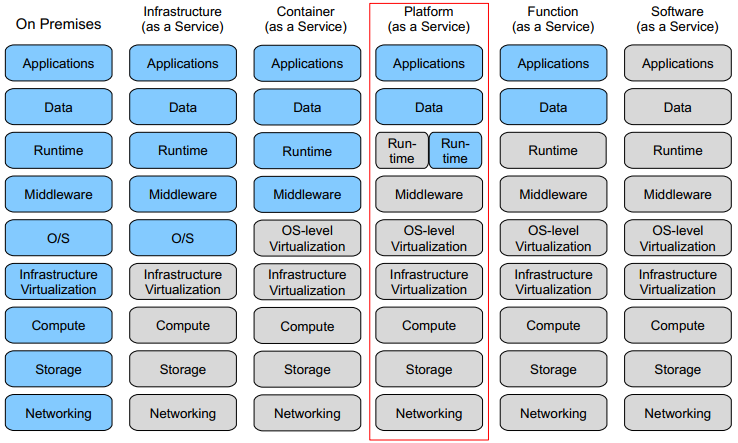
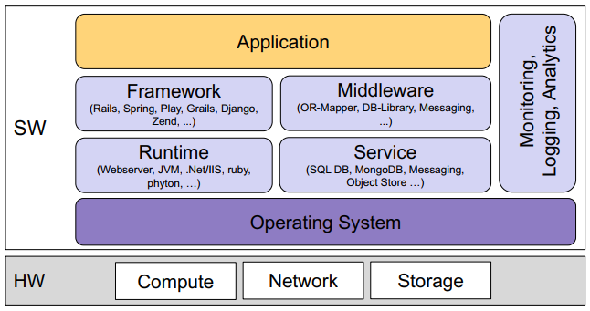
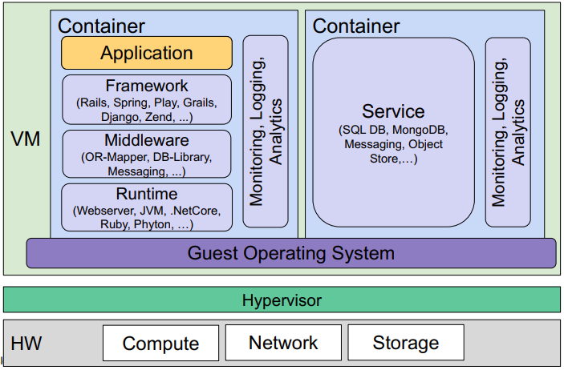
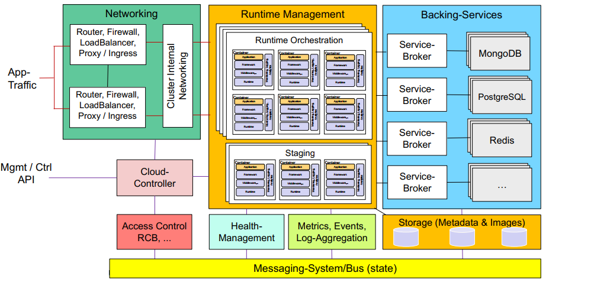
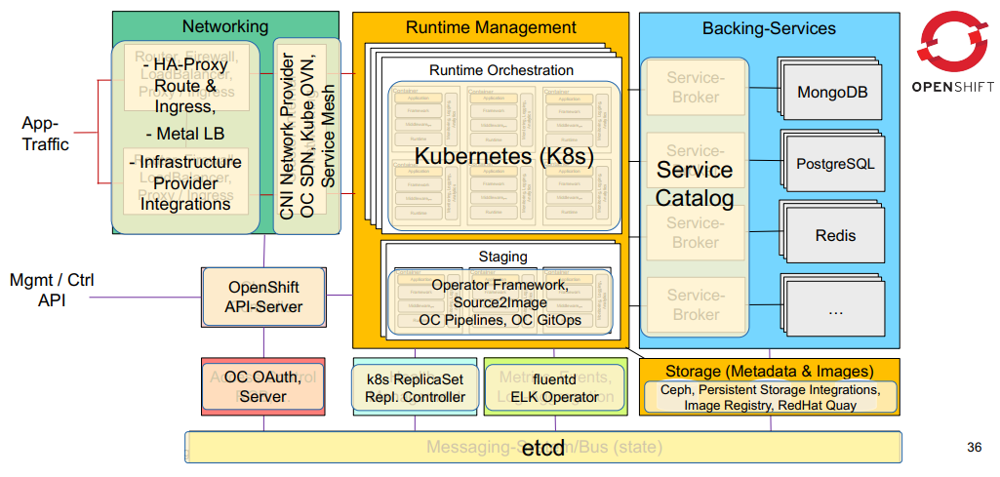
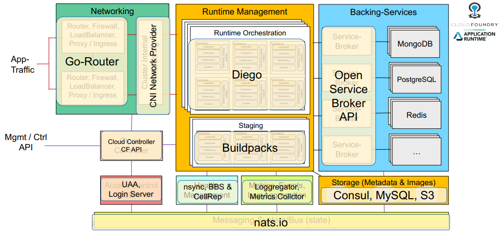
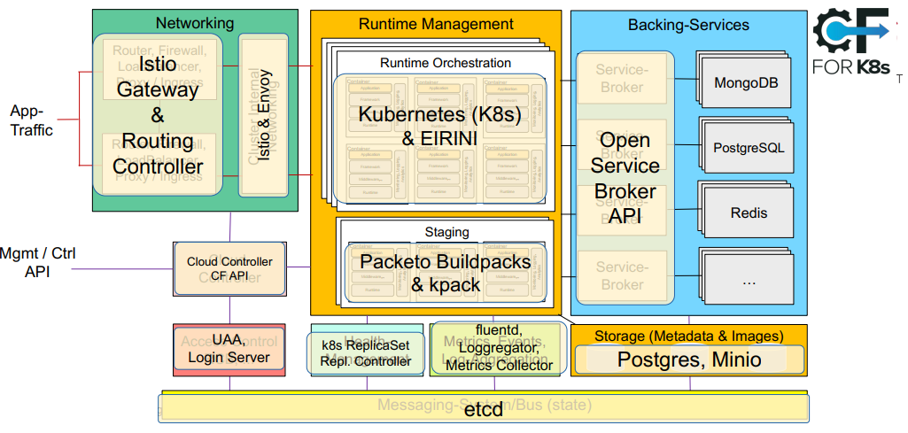

# Platform as a Service (PaaS)
PaaS is a typical solution for developers. In order to by more productive, <u>they should focus on</u>, writing code, working with the programming language runtime, build, CI/CD, etc. <u>They should NOT focus on</u> setting up VMs, deploying OSs, etc. PaaS offers all the required cloud infrastructure so developers can develop and not care about any of that.

NIST definition of PaaS: 
*The capability provided to the consumer is to **deploy onto the cloud infrastructure consumer-created or acquired applications created using programming languages, libraries, services, and tools supported by the provider**. The consumer does not manage or control the underlying cloud infrastructure including network, servers, operating systems, or storage, but has control over the deployed applications and possibly configuration settings for the application-hosting environment*

 

### PaaS vs. Container Orchestration
In **PaaS**, the user has less control over the actual deployment of the application. But, when using a suitable platform/application runtime (OpenShift or CloudFoundry), there is more flexibility to integrate services and tools to the application. *"Here is my code, run it, I don't care how!"*

Also, for vertical markets, building and commercializing domain specific PaaS is an possible business case. Offering a platform for developing new apps fast and easiliy with less involvement from TI.

In **container orchestration** (Kubernetes, Docker Swarm), the user has greater control over the deployment of the application on the cluster. *"Here is my code bundled in a docker image, let me tell you how to run it."*

## Application Runtime Environment
The *runtime* is the component executing the application (e.g., Python intrepreter, of Java VM). The **runtime environment** contains all required SW components to run the application (OS, middlewarem libraries, application, monitoring, etc).

 
*Application + Runtime Environment*

 
*Containerized Application + Runtime Environment*

## Generic PaaS Architecture
 

* **Runtime Management**: Creation/caching/scheduling/placement/disposal of runtimes (VM, container); manages individual app instances; **metadata and images** of runtime environments are stored in persistent storage
* **Networking**: Router/load balancer - handles all TCP/HTTP and routes incoming to component; maintains distributed routing state; often after SSL termination
* **Cloud Controller**: Management of REST API; manages app lifecycle incl. state transitions
* **Health Manager**: Monitors app state, number of instances, bound services; compare intended/actual state; corrective actions
* **Messaging-System/Bus**: Central communication system for internal communication; pub-sub based; very self-protective (backbone of whole system; if it breaks, nothing works anymore).
* **Backing services / sevice brokers**: Backing service marketplace; provision service instances; un/bind service to app; svc broker
API
* **Log aggregation, Event/Metrics-collectors**: Aggregate app logs; emit system events (app/instance state; scaling); emits metrics (usage, uptime, traffic)
* **Access Control and Ops Support**: Access controler; AAA supporting multi-tenancy and user auth/auth; rating, charging, billing

## OpenShift
PaaS solution based on Kubernetes as container runtime. Effectively, it wraps functionalities around Kubernetes to make it easier and faster for developers to deploy containerized applications.

 
*OpenShift Architecture*

## CloudFoundry
PaaS solution focused on development. Runtime based on **Diego** as container management system and Diego Brain's for management.

There is also a flavour called **Eirini** which has Kubernetes as the container management system.

 
*CloudFoundry Architecture*

 
*Eirini Flavour (Kubernetes as management system)*

