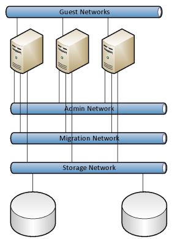

# Cloud Security
Securing a cloud virtualized system is more complex than securing a traditional physical system.
* Cloud infrastructure is shared among multiple tenants that distrust each other; it is even possible that the network traffic in the underlying physical network have sensitive packets from multiple tenants mixed in the same network.
* A breach of the host machine would expose all the guests running on it. The impact would be bigger
* Sharing resources augment the attack surface
* Management and privileged access to hosts is available over the network
* Network boudaries are logical, not physical (that means boundaries can be crossed)

## Securing a Cloud
### Physical security
Physical security in a cloud infrastructure is the same as in a traditional datacenter, i.e., there is access control.

### Redundancy (for recovering from outages)
Building redundancy is easier in a cloud environment. Downtime is greatly reduced as VMs are movable. Containers in the other hand are not, as they are processes inside a host OS.

### Networking
VLANs of multiple customers must be streamlined. This may be hard to fulfill and is usually done by giving access over VLAN synonyms instead of the regular numbers (max of 4096 VLANs in a LAN)

Also, <u>traffic must be physically separated into different neworks in the infrastructure</u>:
* *Guest Networks:* Network for client traffic. The least sensitive.
* *Admin Network:* Allows privileged acceess to the hosts. Should be highly restricted.
* *Migration Network:* Used for migrating VMs. Sensitive because the VM images goes unencryted. Very bandwidth intensive, since the images are large
* *Storage Network:* Used for fetching and backing-up VM images. Has the same characteristics as the migration network
* *(optional) Heartbeat Network:* Used to heath monitoring of the components

 
*Separated physical networks in a cloud infrastructure*

### Computing virtualization security
The hypervisor must shield the (typically overcommited) compute resources in order to avoid a DoS attack by resouce exhaustition. 
Also, sharing RAM and disk could potentially lead to data exposure. Here encrypting disks and backups and applyint ACLs to access to data is necessary. 
Also, a spy could gather information about a neighbour VM use of CPU, memory access and memory caching. **Attacks like Flush & Reload and S$A are based on this kind exposure**.

### Identity and Access Management (IAM)
Is a must for any cloud system. Access management must cover:
* Hardware access
* Full virtual infrastructure control
* Full virtual infrastructure access
* Partial virtual infrastructure control
* Partial virtual infrastructure access

### More
It is important to understand that security coordination, operational security, and incident management become more complex as multiple legal entities are involved in such a process. Liability or impact become weak terms as they heavily depend on the point of view. 
Operational security is not as easy to achieve as in physical environments. There are always multiple players of possibly different legal entities are involved and not all players have the same access to information. Communication becomes therefore a key in cloud security and incident management.

## Data Protection Act (DPA)
Personal data (from individuals) is specially sensitive and cannot be exported (unless explicitly allowed and the destination has equivalent laws on data protection) neither disclosed. This can pose problems for providing support to cloud systems if they are outsourced from abroad.

## Known Threats Specific to Virtualization

### DoS attack
Deplates resources of a system with irrelevant load so it becames irresponsive for actual relevant requests. Virtualized systems are more vulnerable to this kind of attack due to their complexity.

Streaming is one of the most (perhaps the most) bandwidth demanding services in the internet. Therefore, web-cameras are common vectors in a DDoS attack.

Usually the connection of a firewall to the internet is prone to DDoS because all the communication (i.e., bandwidth) passes through it. That is why it is important for internet providers (that provide internet backbones) to deploy "distributed" firewall to filter the trafic in the internet.

If the capacity of the cluster network is much bigger than the entry line, it is more interesting (from an attacker point of view) to attack the network
from the inside, by leasing a lot of resources.

**Exhausting host CPU** 
<u>Attack</u>: Run one or more guests at full speed, eating up all of host's CPU. 
<u>Impact</u>: Normally very limited impact as we do have good scheduling on a per host base. 
<u>Mitigation</u>: Control how much elaticity guests are allowed to have; Limit resources reservation (not desirable, since a cloud provider makes profit by offering elastic resources); use of algorithms to detect if a guest actually need more resources.

**Exhausting cluster network** 
The easiest way to fill a physical net is triggering multiple live migration while creating high memory loads (assuming load balancing systems). Filling guest networks with broadcast traffic is another good way of overwhelming virtual/physical boundaries.

### Priviledge Escalation
Escaping the VM to have access to the host machine. This can be done at hardware level or hypervisor level. Whitelists/blacklists are not a good security strategy against priviledge escalation because the maintenance of these lists is quite time consuming (updating allowed/blocked processes) and not hard to be worked-around.

**Management Attacks** 
<u>Attack</u>: Most of the attacks targeting virtual hosts do not attack the hypervisor but its management. Simple attacks include weak passwords or badly secured APIs on the management level of the hypervisor. 
<u>Impact</u>: Control over all aspects of the hypervisor including underlying infrastructure such as centralized storage. May pDoS all guests and the hypervisor 
<u>Mitigation</u>: Isolate management networks; Use strong credentials.

**Rootkit Attacks** 
<u>Attack</u>: Access VM from a Ring “below ground” (with priviledges over the hypervisor) by using malicious software. There are known rootkit’s (e.g., evil maid, ACPI rootkits) which is attacking on this layer. 
<u>Impact</u>: Free access to data and control (including subsequent systems of the hypervisor) 
<u>Mitigation</u>: Whitelist and hardening of the hypervisor.

**Flip Feng Shui** 
Makes use of **rowhammer**, an attack targeted to DRAM in which writing repeatedly to some target rows results in fliping a bit of an adjacent row due to electro magnetic radiation. Rowhammer is very much hardware dependent.

<u>Attack</u>: Applying rowhammer attack to a virtual machine guest or host system to alter one bit of the public key, which makes it no a product of prime numbers anymore, simplifying factorisation. 
<u>Impact</u>: Controlled RAM writing over VM boundaries possible. 
<u>Mitigation</u>: Use ECC-Ram or DDR4; Decrease maximum refresh time of memory (increase power consumption and heat; at must 52 ms).

**Flush and Reload** 
Makes use of the CPU caching memory at the CPU cache (L3-cache), which can be flushed and reloaded from memory. By timing this process, infromation can be stolen.
<u>Attack</u>: Access read protected memories by exploiting timing of of L3-Cache. 
<u>Impact</u>: Memory in other virtual machines can be read and information may be stolen. 
<u>Mitigation</u>: Disable memory deduplication technologies on all layers.

## Hardening of a virtualization cluster
### Physical networks
Separate network categories physically, at least admin, migration, storage and guest networks (possibly heartbeat as well). No VLANs to combine multiple categories.

### Virtual networks
Always offer tag-free networks to guests, i.e., offeer port-based VLANs or simply create more virtual network cards. Don't let the guest know their VLANs, Never connect them to trunks.

Do not make admin networks available in guest space; Limit bandwidth available to a single guest;  Avoid cross host traffic by defining affinities and diffinities in the guest.

### Hypervisor management
Encrypt all traffic; Make sure that there are no default passwords set.; Make sure that you use certificates instead of passwords wherever possible; Enable password changes by either syncing local accounts or introduce a
centralized authentication and authorisation provider; Patch, patch, patch, and if it does not help: patch again.

### Cluster management
Same as hypervisor management above.

A cluster management should never be virtualized. Typically, it is located somewhere separated from the cluster itself. That makes sense because the cluster have to be initialized and managed.

